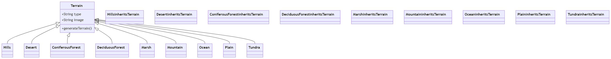

## Commençons simplement

### Les maths

#### Faites du bruit

On peut commencer directement par le code de la classe `Bruit2D`. C'est censé être une classe abstraite de définition du bruit, mais on dirait que celui qui l'a développé s'est arrêté en plein milieu...

### `Question` 

**pourquoi l'attribut graine est-il en final ?**

### `Réponse` 

**L'attribut `graine` dans la classe `Bruit2D` est déclaré comme `final` pour qu'on ne puisse pas 
le changer après sa première definition.**

## Un peu de modélisation objet dans votre Perlin ?

Soufflez un peu. Vous avez fini la partie la plus mathématique du sujet. Passons à la partie modélisation, que vous adorez déjà !

On cherche à réaliser un générateur de carte 2D avec différents types de terrains (une grille de cases, à l'ancienne).

Voici les terrains que l'on souhaite pouvoir manipuler :

- des collines
- des déserts
- des forêts de conifères
- des forêts de feuillus
- des marais
- des montagnes
- des océans
- des plaines
- des toundra

On pourrait, par exemple, construire une classe pour chaque, qui hériterait de `Terrain`, comme classe mère.

### `Question :` 

**Réaliser l'architecture que prendrait la forme d'une telle modélisation sous forme 
d'un diagramme UML. Quelle serait la différence d'attributs et de méthodes entre ces classes ? 
Expliquer, en s'appuyant sur un exercice vu en cours, pourquoi c'est une mauvaise idée. 
Quelle est la solution qu'il faudrait préférer (et que l'on va préférer) ?**

### `Réponse`

### Modélisons le (type de) terrain

### Au terrain, maintenant

La plupart des jeux de type bac à sable utilisent trois valeurs pour générer ce qui est nécessaire à la détermination d'un élément : son altitude, son hydrométrie, et sa température. Ça tombe bien, on va suivre plus ou moins (en simplifiant) ce principe.

Créez la classe `Terrain` qui comportera trois accesseurs (un pour l'hydrométrie, un pour la température, et un pour l'altitude) - `getHydrometrie`, `getTemperature` et `getAltitude`. On veut pouvoir rentrer des informations décimales suffisamment précises (au moins en double précision).

### `Question` 

**quel type utilisez-vous ?**

### `Réponse`
**J'utilise le type double permettant d'obtenir une meilleur précision,
convenable pour stocker des valeurs décimales.**

### Suite du terrain

Pour des raisons de simplification, on **ne veut pas** que les valeurs de ces caractéristiques soient faites "à la louche". On s'assurera donc de les limiter : l'hydrométrie et la température doivent être comprises entre 0 et 1, l'altitude entre -1 et 1. On lèvera l'exception `MauvaiseValeurException` si une condition n'est pas respectée. L'exception en question héritera d'une exception **qui détermine qu'un argument est illégal**.

Ajoutez ensuite une méthode qui accepte un visiteur, la méthode `TypeTerrain getTypeTerrain(DetermineurTerrain dt)`.

Cette méthode vous semble étrange ? C'est l'implémentation d'un patron qu'on a déjà vu, le patron Visiteur (mais sans le nommer). Pour faire simple, c'est un modèle comportemental qui permet de séparer un algorithme de la structure d'un objet sur lequel il opère. Il est utilisé lorsque vous avez une structure complexe d'objets et que vous souhaitez appliquer différentes opérations à ces objets, mais que vous ne voulez pas modifier directement leurs classes.

Ce modèle est composé de trois éléments principaux :

- Visiteur : Il définit une interface comportant une méthode pour chaque type d'objet de la structure. Chaque méthode visite un type spécifique d'objet.
- Éléments : Ce sont les différents types d'objets de la structure. Ils possèdent une méthode acceptant un visiteur en paramètre. Cette méthode invoque la méthode correspondante du visiteur.
- Structure : C'est la collection d'objets que le visiteur peut parcourir et traiter.

L'avantage clé du patron Visiteur est sa capacité à ajouter de nouvelles opérations sans modifier les classes des éléments existants. C'est une approche idéale lorsque la structure d'objets est fixe, mais que de nouvelles opérations sont susceptibles d'être ajoutées fréquemment.

En utilisant le patron Visiteur, vous pouvez séparer le code lié à la manipulation des objets de leur structure, ce qui rend le code plus modulaire et extensible. Cependant, cela peut rendre le code plus complexe, surtout lorsque la structure d'objets est sujette à des changements fréquents.

Dans notre cas, on veut pouvoir déterminer le type de terrain en fonction des trois caractéristiques, mais on veut éviter de modifier la classe à chaque fois qu'on change de détermination - on a donc un Visiteur qui s'en occupe.

### `Question` 

**pourquoi sortir, selon vous, ce bout d'algorithme de la classe ?**

### `Réponse`

**Utiliser un `Patron Visiteur` pour séparer l'algorithme de la classe principale permet de faciliter le programme.
Dans notre cas, cela nous permet d'ajouter de nouvelles façons de déterminer le type de terrain sans avoir à modifier la classe qui contient les caractéristiques.**